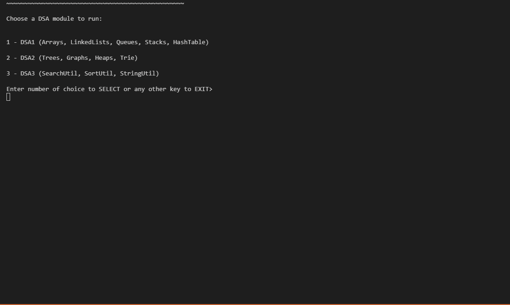

# DSA-Java-Exercises


A collection of data structures and algorithm exercises in Java. CLI-based, self-contained, and beginner-friendly.

## Demo



## Summary

This repository contains a comprehensive collection of Java implementations for classic Data Structures and Algorithms (DSA) exercises. All exercises are based on the curriculum from CodeWithMosh's three-part DSA course, _The Ultimate Data Structures and Algorithms_. The project is organized by topic and serves as a personal capstone to reinforce Java fundamentals and algorithmic thinking through hands-on coding.

## Interactive CLI Program

The project includes an interactive command-line interface (`Main.java`) that allows users to explore and experiment with almost all of the data structures and algorithms implemented in this repository.

-   The CLI serves as a hands-on sandbox, enabling you to call various methods, manipulate structures, and visualize results without editing code directly.

-   Once running, follow the on-screen prompts to choose a data structure or algorithm to interact with.

> **Tip**: This is a great way to reinforce learning, test edge cases, or demo behavior without needing an IDE.

## Structure

The project is divided into three main sections:

-   **dsa1**: Foundational data structures

    -   Arrays
    -   Stacks and Queues (including implementations using other structures)
    -   Linked Lists
    -   Hash Tables

-   **dsa2**: Intermediate and advanced data structures

    -   Heaps (MaxHeap, MinHeap, with Recursive & Iterative Heapifiers)
    -   Trees
    -   Graphs
    -   Priority Queues
    -   Trie

-   **dsa3**: Core algorithms
    -   Search (e.g., Linear Search, Binary Search, Jump Search)
    -   Sort (e.g., Bubble Sort, Merge Sort, Quick Sort)
    -   String Manipulations (e.g., Anagram checks, character counting)

## Getting Started

### Requirements

-   Java Development Kit (JDK) 17

### Running the Code

1. **Clone the repository:**

    ```bash
    git clone https://github.com/RussBurnham/DSA-Java-Exercises.git
    cd DSA-Java-Exercises
    ```

2. **Compile the CLI entry point:**

    ```bash
    javac Main.java
    ```

3. **Run the program:**
    ```bash
    java Main
    ```

> **Tip:** If `Main.java` relies on files in subdirectories or packages, you may need to compile everything:
>
> ```bash
> javac */*.java Main.java
> ```

## Notes

-   Each class is self-contained, and most include a `main` method for testing or demonstration.
-   You can edit any file to test edge cases, new logic, or improvements.
-   If you’re using an IDE (like IntelliJ IDEA, Eclipse, or VS Code), simply import the project as a Java project and run individual classes with ease.

## Author

**Russ Burnham** – [GitHub](https://github.com/RussBurnham)

## Acknowledgments

This project is based on exercises from the excellent _The Ultimate Data Structures and Algorithms_ series by [CodeWithMosh](https://codewithmosh.com/).

## License

This project is licensed under the [MIT License](LICENSE).  
You are free to use, modify, and distribute this project for personal or commercial purposes.

